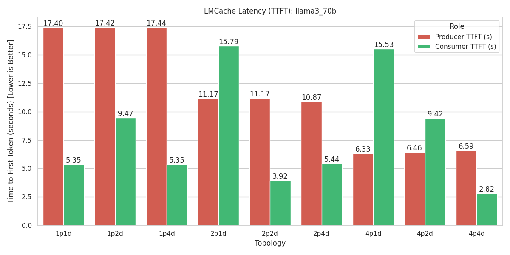
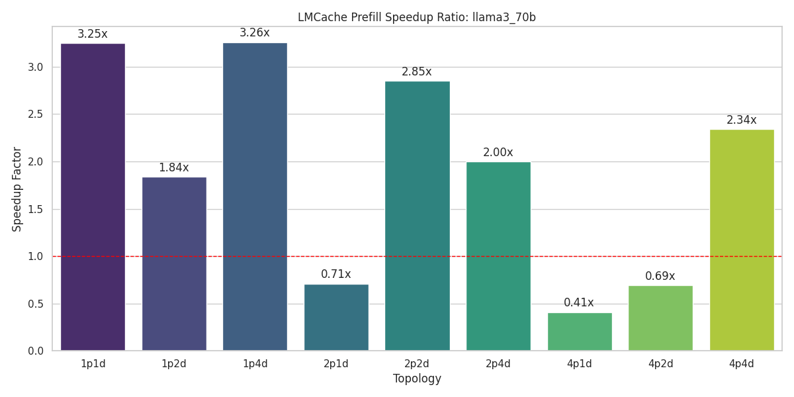
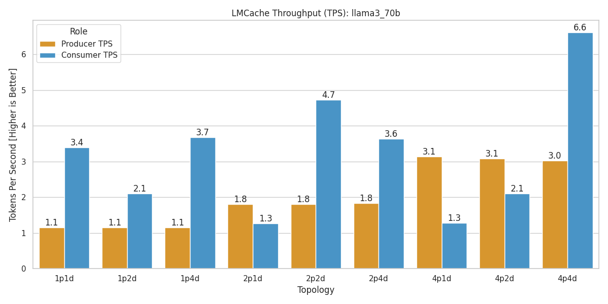
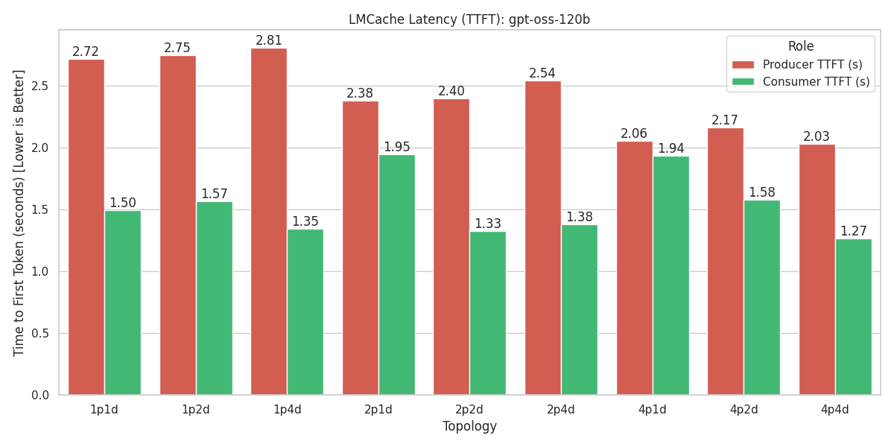
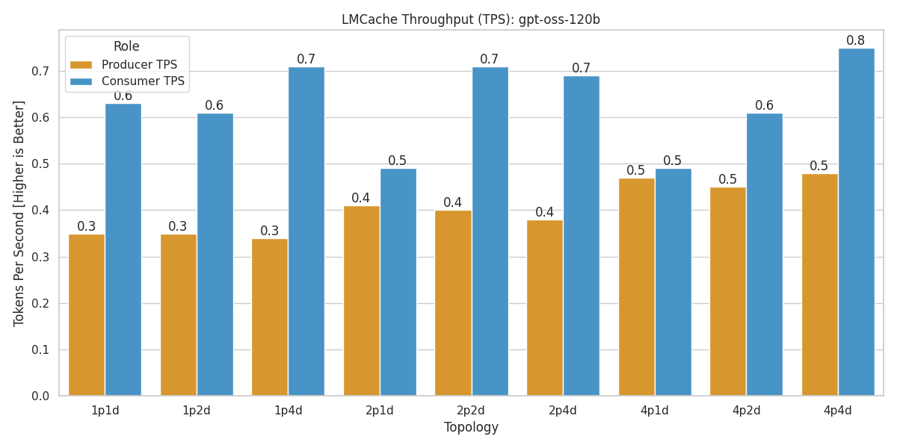

# 進度統整

把 LMCache 和 vLLM 成功架起來後，測試了 LLama-3.3-70B-Instruct 和 gpt-oss-120b 模型，兩個模型都能正常使用 LMCache 進行 KV Cache 的讀寫。

測試均採用相同 prompt，長度爲 22660 tokens，涵蓋多種領域和主題。

```python
TEST_PROMPTS = [
    # 1. 技術演進分析 (模擬長文生成與推論)
    """
    You are a senior technology historian and computer architect.

    Context:
    The evolution of General Purpose GPU (GPGPU) computing has shifted significantly from fixed-function graphics pipelines in the early 2000s to the highly programmable, tensor-core accelerated architectures of today.
    Key milestones include the introduction of CUDA by NVIDIA in 2006, the development of OpenCL for cross-platform compatibility, and the rise of AMD's ROCm ecosystem.
    In the 2010s, the focus shifted towards deep learning, with hardware explicitly designed for matrix multiplications (e.g., Tensor Cores, Matrix Cores).
    Recently, the interconnects (NVLink, Infinity Fabric) and memory hierarchies (HBM, diverse cache levels) have become just as critical as the compute cores themselves to alleviate the memory wall bottleneck in Large Language Model training.

    Task:
    Based on the context above and your internal knowledge, generate a comprehensive report comparing the architectural philosophy differences between NVIDIA's "Hopper" architecture and AMD's "CDNA 3" architecture. Focus specifically on how each handles memory coherency and FP8 precision for LLM inference.
    """,

    # 2. 法律/條款摘要 (模擬 RAG 或文件分析 - 高 Prefill 負載)
    """
    You are a legal assistant specializing in software licensing and cloud service agreements.

    Document:
    [...Assume a long excerpt of a cloud Service Level Agreement (SLA) follows...]
    1. Service Availability: The Service Provider guarantees 99.9% uptime during any monthly billing cycle.
    2. Credits: In the event of downtime exceeding the allowance, customers are eligible for service credits equal to 10% of their monthly bill for every 1 hour of downtime, capped at 50% of the total monthly bill.
    3. Exclusions: Downtime caused by scheduled maintenance (with 24h notice), force majeure events, or customer-side network configurations is excluded from the uptime calculation.
    4. Termination: Customers may terminate the agreement for cause if the Service Availability drops below 95% for three consecutive months.
    5. Data Retention: Upon termination, customer data will be retained for 30 days before permanent deletion.
    [...Assume 20 more distinct clauses about liability, indemnity, and jurisdiction...]

    Task:
    Identify potential risks for a startup company relying on this service for a mission-critical real-time payment gateway. Specifically, analyze the "Exclusions" and "Termination" clauses and explain why the 99.9% guarantee might be insufficient for financial services.
    """,

    # 3. 程式碼重構 (模擬 Coding Assistant)
    """
    You are a senior software engineer specializing in Python and High-Performance Computing.

    Code Snippet:
    ```python
    def messy_matrix_processing(data, rows, cols):
        res = []
        for i in range(rows):
            row_list = []
            for j in range(cols):
                val = data[i][j]
                if val > 0:
                    temp = val * 2
                    if temp % 3 == 0:
                        temp = temp / 3
                    row_list.append(temp)
                else:
                    row_list.append(0)
            res.append(row_list)

        # ... verify results ...
        return res
    ```

    Task:
    The above code is functionally correct but computationally inefficient for large datasets.
    1. Rewrite this function using NumPy vectorization to eliminate the nested loops.
    2. Explain how the CPU cache locality is improved by your vectorized solution compared to the list-of-lists approach.
    3. Provide a brief example of how to parallelize this further using Numba `jit`.
    """,

    # 4. 創意寫作與世界觀建構 (模擬長文本生成)
    """
    You are a sci-fi novelist designing a setting for a cyberpunk story.

    Setting:
    The year is 2142. The city of Neo-Taipei is a multi-layered metropolis suspended above the rising sea levels.
    The "Upper District" utilizes atmospheric processors to keep the air clean, inhabited by the corporate elite who control the "Neuro-Link" network.
    The "Under-Tide" sector is submerged specifically during high tide, forcing its inhabitants to live in amphibious container homes.
    Currency has been replaced by "Compute-Credits", which are mined by human brain activity during sleep.

    Task:
    Write a prologue for a story following a protagonist named "Kai", a rogue technician who repairs obsolete servers in the Under-Tide. Start the scene with Kai discovering a pre-war AI fragment inside a water-damaged server rack during a typhoon. Describe the sensory details of the humidity, the sound of the storm, and the hum of the old hardware.
    """,

    # 5. 科學論文解釋 (模擬學術研究助手)
    """
    You are a research scientist explaining complex astrophysical simulations to a graduate student.

    Abstract:
    We present 'Galaxy-Sim', a new hybrid code coupling N-body dynamics for dark matter with mesh-based hydrodynamics for baryonic gas.
    Unlike traditional Smooth Particle Hydrodynamics (SPH), our approach uses an Adaptive Mesh Refinement (AMR) grid to capture shock waves with high fidelity.
    We apply this to simulate the merger of two neutron stars, focusing on the gravitational wave emission and the subsequent kilonova nucleosynthesis.
    Preliminary results suggest that magnetic field amplification at the merger interface is faster than previously predicted by pure magnetohydrodynamic (MHD) models.

    Task:
    Explain the key advantage of using AMR (Adaptive Mesh Refinement) over SPH (Smooth Particle Hydrodynamics) specifically in the context of "capturing shock waves" mentioned in the abstract. Use an analogy related to resolution scaling to make it clear.
    """
]
```

以下會分析 TTFT 和 TPS 在兩個模型分別的加速效果。

## LLama-3.3-70B-Instruct 測試結果

### TTFT 測試




### TPS 測試



### 小結

可以看出當 decode 使用的 GPU 數量少於 prefill 時，加速反而會倒退，這可能是因為 LMCache 在多 GPU 間同步 KV Cache 時的開銷超過了命中 Cache 所帶來的效益。

並且在 Decode GPU 數量和 Prefill GPU 數量相同時，TPS 有明顯的提升，最高可達 3.25x。

極端情況下例如 1p4d 也有非常高的加速比，推測可能是因為 decode 階段龐大的 GPU 算力反超 KV Cache 同步的開銷。

## gpt-oss-120b 測試結果

### TTFT 測試




### TPS 測試



### 小結

gpt-oss 的加速相較於 Llama-3.3 較爲平緩，但在 Decode GPU 數量較高或相等於 Prefill GPU 數量時，仍然可以看到明顯的加速效果。

效果較差的情況有 2p1d, 4p1d, 4p2d（均不超過 1.5x），和 Llama-3.3 類似。

## 總結與後續規劃

這次的測試很成功，LMCache 在兩個大型語言模型上都能正常運作並帶來效能提升。

<!-- 目前規劃接下來要做的事情有：

1.  -->