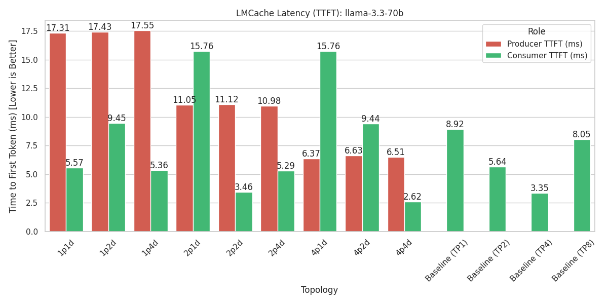
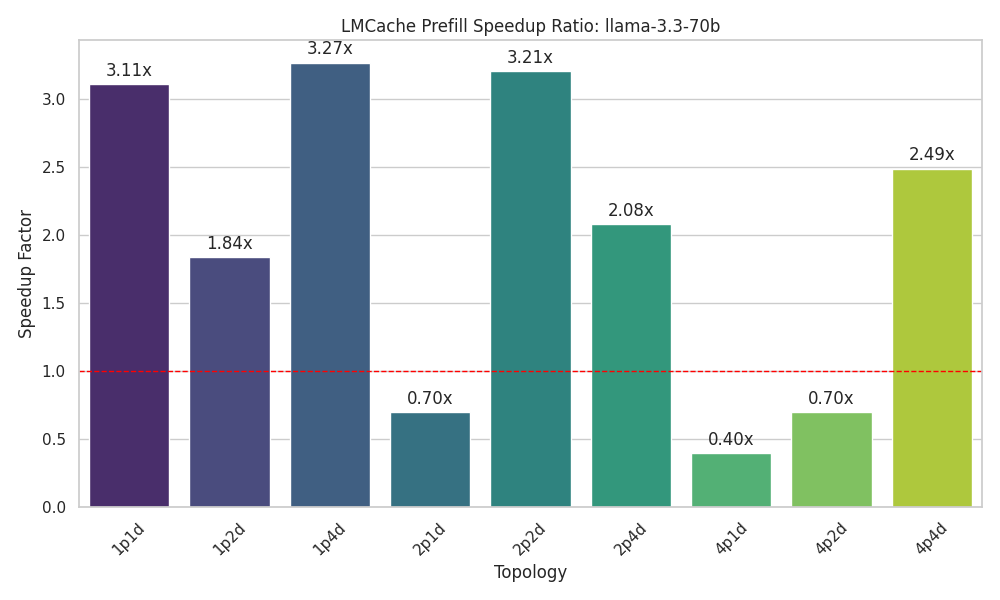
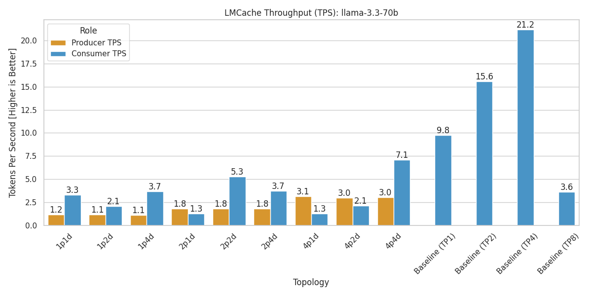

# 進度統整

以下是 LMcache 使用 Llama-3.3-70B-Instruct 和 gpt-oss-120b 模型，多個 instance，每個 instance 使用 1 GPU 的情況下，測試 TTFT（Two-Stage Token Fetching）和 TPS（Two-Phase Scheduling）兩種不同的加速策略的結果。

這次圖表中包含了 TP1、TP2、TP4、TP8 等不同的模型並行數量，作為比較基準。

## LLama-3.3-70B-Instruct 測試結果

### TTFT

### TPS

## gpt-oss-120b 測試結果

### TTFT

### TPS

## 結論

模型在 TP1, 2, 4 時表現較好，TP8 時效果較差。

這週主要在重構測試用腳本，包含生成測試設定檔和收集結果等功能，以便未來加入更多測試場景例如不同 concurrency 等。
