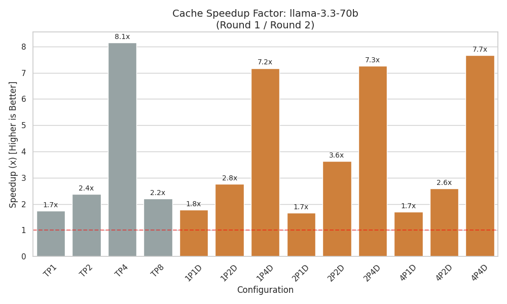
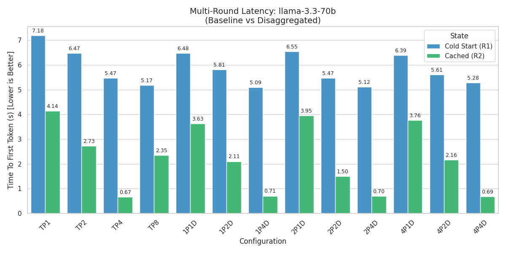
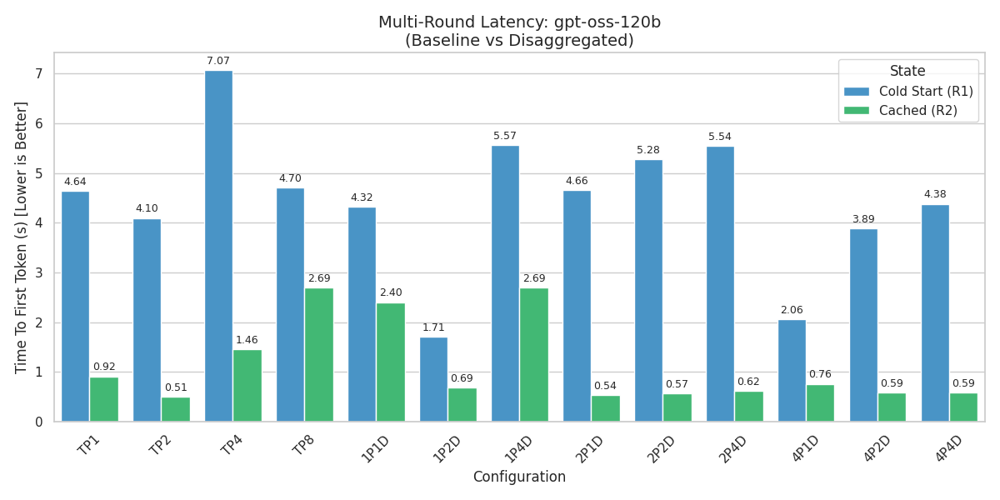
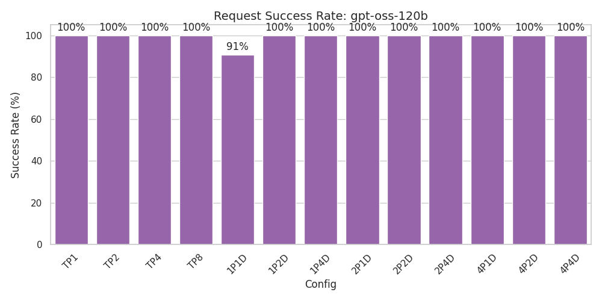

# 進度統整

這週加入了針對 consumer 的併發請求機制，目前設定爲 1024，且加入了多輪對話，以凸顯 KV Cache 帶來的效能提升。

以下圖表包含 TP1, 2, 4, 8 和 Prefill 1, 2, 4，Decode 1, 2, 4 等不同的模型並行數量和 Prefill/Decode GPU 數量的組合，且同樣使用 Llama-3.3-70B-Instruct 和 gpt-oss-120b 模型作為比較基準。

## LLama-3.3-70B-Instruct 測試結果

### TTFT

### Success Rate

## gpt-oss-120b 測試結果

### TTFT

### Success Rate

這邊有觀察到 1P1D 的請求成功率不是 100%，但因為要復現有難度，先不深入調查原因，後續會再觀察是否有其他異常情況發生。

## 結論

在增加多輪對話和併發數後，模型的 TTFT 有顯著的提升，不論是先前測試中 Decode TP 數量少於 Prefill TP 的組合，或是其他原先就表現較好的組合，都有明顯的效能提升。
