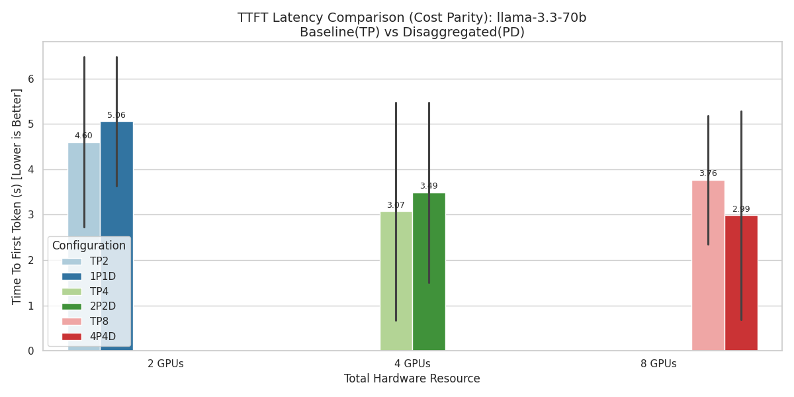
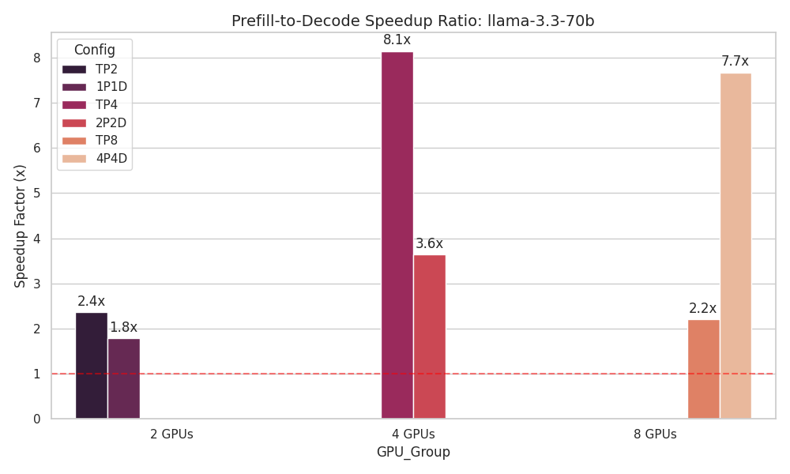
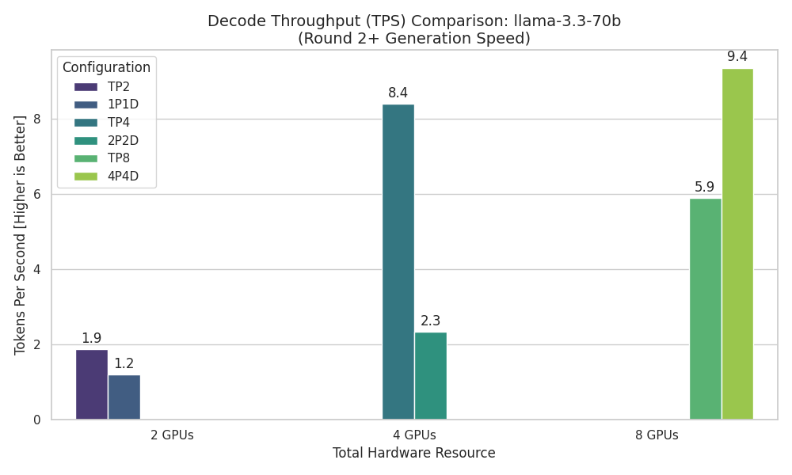
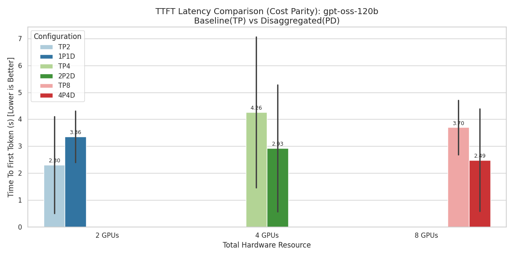
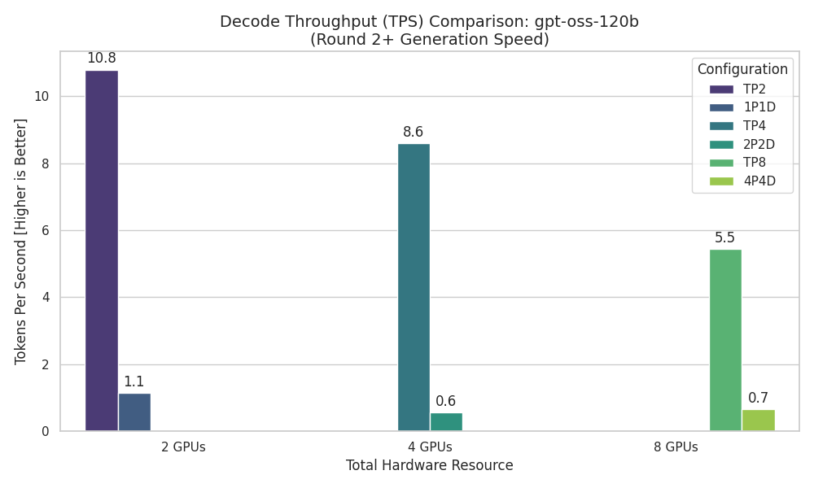

# 進度統整

這次分析了併發 1024 請求的多輪對話下，相同 GPU 數量不同拓樸，包含單純 TP 和 PD 分離的情況，來觀察其效能表現。

## LLama-3.3-70B-Instruct 測試結果

### TTFT

### TPS

## gpt-oss-120b 測試結果

### TTFT

### TPS

## 結論

觀察以上圖表發現，總量爲 2, 4 GPU 時 TP 表現較好，但總量爲 8 GPU 時，PD 分離的 TTFT 優於 TP，但 TPS 在不同模型中表現不一，Llama-3.3-70B-Instruct 在 PD 分離 8 GPU 的情況下超越 TP，但 gpt-oss-120b 不論使用多少 GPU 都是 TP 表現較好，這可能與模型架構和計算需求有關，需要進一步分析來確定原因。
