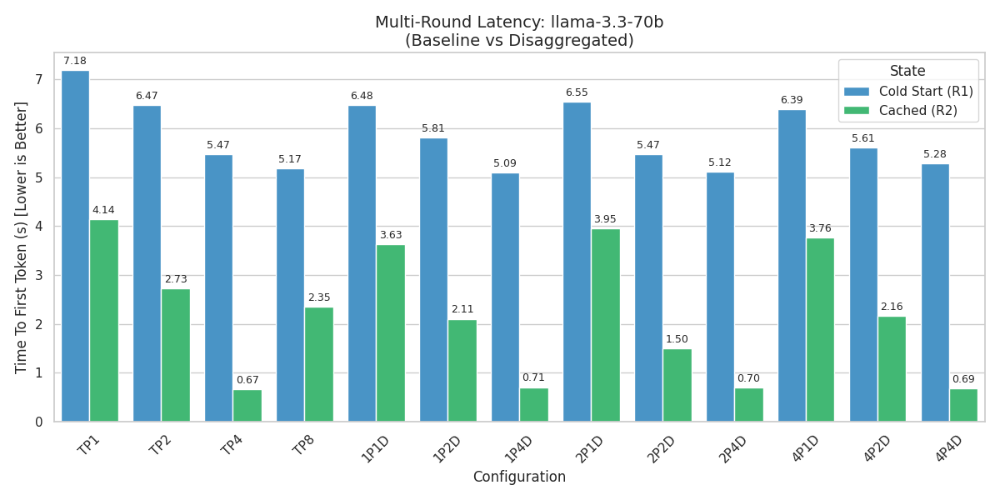
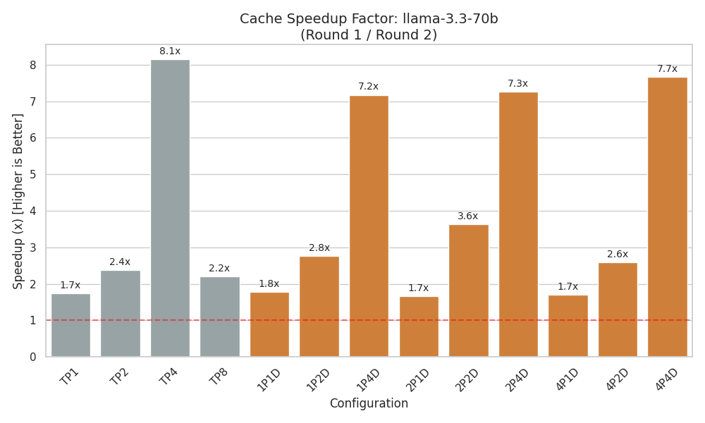
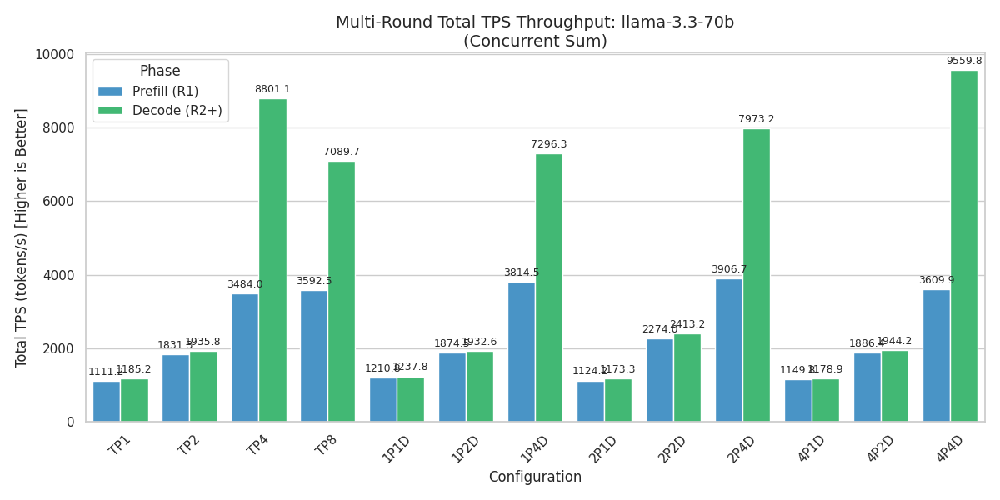
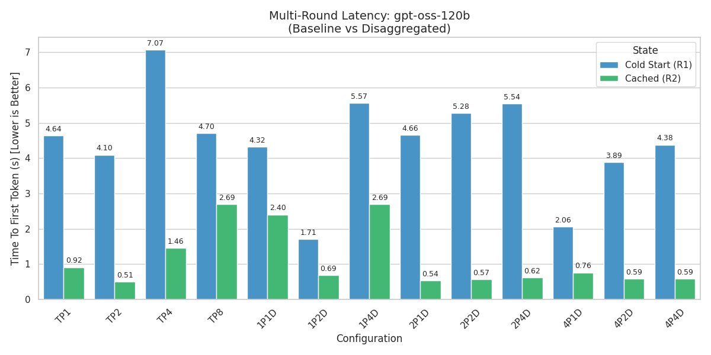
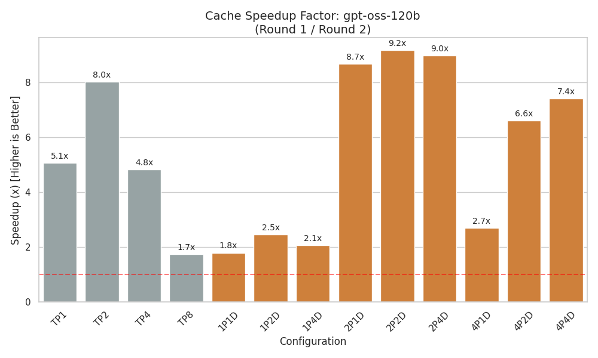
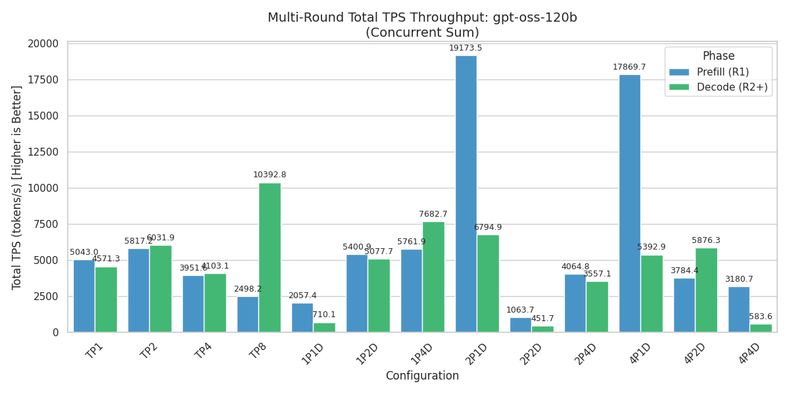

# 進度統整

這兩週將 Prefill 和 Decode 的併發數都改為 1024，並在分析時使用所有請求加總 TPS 來計算整機吞吐量的提升，來觀察在高併發情況下不同拓樸的效能表現。

以下 TTFT 均為平均值，TPS 為 1024 併發下的加總。

## 程式碼庫

所有測試都使用這個程式碼庫來執行，包含測試腳本和分析腳本：

[NCHC gitlab - Young/lmcache_benchmark_orchestrator](https://gitlab.td.nchc.org.tw/Young/lmcache_benchmark_orchestrator)

## LLama-3.3-70B-Instruct 測試結果

### TTFT

### TPS

## gpt-oss-120b 測試結果

### TTFT

### TPS

## 結論

兩個模型在 Decode 4 GPU 以上的時候 TPS 吞吐量表現會遠超 Prefill，但如果 Decode 的 GPU 只有 1 或 2 時，TPS 只持平或略好於 Prefill。

使用 gpt-oss 模型時在 1p1d, 2p1d, 2p2d, 4p1d, 4p4d 的情況下 Decode 的表現很差，懷疑可能有其他問題存在（即使 TTFT 均有提升），需要進一步分析來確定原因。

TTFT 部分 Llama-3.3 結果很穩定，只要 GPU 數量增加就會有明顯提升。

gpt-oss 的 TTFT 在 1 prefill 的時候最多只有 2.5x 的加速，但換到 2 Prefill 就有 8.7x ~ 9.2x 的加速，但從前面秒數長條圖的結果來看，2 Prefill 時 TTFT 反而比 1 Prefill 還要慢。
