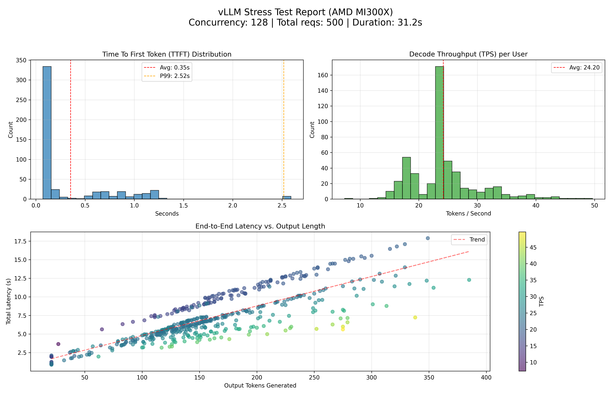

# Benchmark - Llama-3.1-70B

測試腳本中下面四個參數可以依照情境調整：

```py

# Benchmark settings

CONCURRENCY = 128# Max simultaneous in-flight requests

TOTAL_REQUESTS = 500# Total requests to perform

INPUT_LEN_APPROX = 2048# Target input token length

MAX_TOKENS = 512# Max output tokens

```

測試結果如圖：


