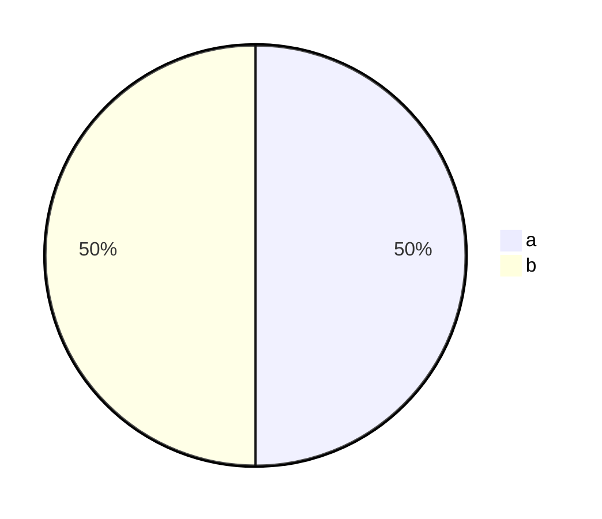

# Markdown 筆記

[TOC]

## 語法介紹
### 使用標題

```
# 大標題
## 第二大標題
......
###### 第六大標題
```

### 清單

1. 有序清單 數字 1
2. 有序清單 數字 2
3. 有序清單 數字 3

- 無序清單
- [ ] 未完成事項
- [x] 已完成事項

```
1. 有序清單 數字 1
2. 有序清單 數字 2
3. 有序清單 數字 3

- 無序清單
- [ ] 未完成事項
- [x] 已完成事項
```

### 使用縮排

縮排能夠用在圓點和已 / 未完成事項上，
層數不同開頭的符號也不同。

- 人類
    - 男性
    - 女性
    - 其他

- 生物
    - 動物
        - 陸生
        - 海生
    - 植物
    - 菌物

```
- 人類
    - 男性
    - 女性
    - 其他

- 生物
    - 動物
        - 陸生
        - 海生
    - 植物
    - 菌物
```

### 使用引用

> hello

```
> hello
```

#### 進階引用 (HackMD上適用)

> hello [name=Young]

> [time=Mon, Nov 14, 2022 8:17 AM]

> [color=#18ce7c] aaaaa

```
> hello [name=Young]

> [time=Mon, Nov 14, 2022 8:17 AM]

> [color=#18ce7c] aaaaa
```

### 使用分隔線

---

```
---
```

### 插入超連結

[Young's Github](https://github.com/Young-TW)

```
[Young's Github](https://github.com/Young-TW)
```

### 插入圖片


```

```

### 使用字體樣式

**粗體**
~~刪除線~~

```
**粗體**
~~刪除線~~
```

### 使用圓餅圖



### 使用 LaTeX 數學公式

```

$$ 公式 $$

```

$$ f(x,y,z) = 3y^2z \left( 3+\frac{7x+5}{1+y^2} \right) $$
